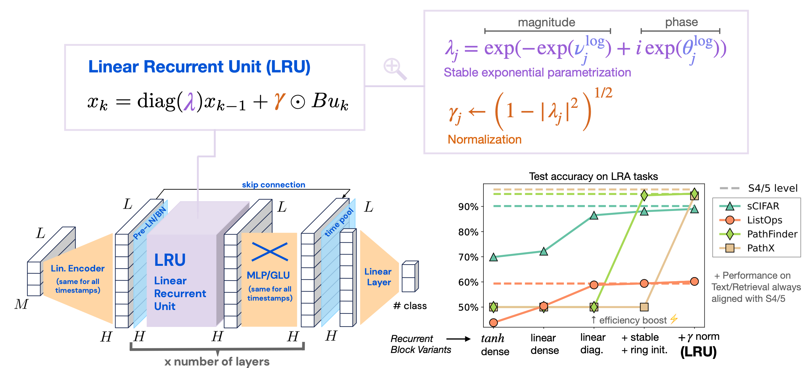

# Minimal LRU

This repository is an unofficial JAX implementation of the Linear Recurrent Unit (LRU) paper:

**Resurrecting Recurrent Neural Networks for Long Sequences**  \
Antonio Orvieto, Samuel L Smith, Albert Gu, Anushan Fernando, Caglar Gulcehre, Razvan Pascanu, Soham De\
ICML, 2023\
[arXiv](https://arxiv.org/abs/2303.06349)



<p style="text-align: center;">
Figure 1:  Visual summary of the LRU architecture (taken from the LRU paper).
</p>

The goal of this project is to provide a concise codebase that contains everything needed to run a
recurrent neural network made of LRUs on various benchmarks. The LRU layer builds
upon existing work on deep state space models, and so does this repository. It is adapted from the
[S5 repository](https://github.com/lindermanlab/S5), which was itself derived from a
[JAX implementation](https://github.com/srush/annotated-s4) of S4 by Rush and Karamcheti. The
implementation of the LRU layer is an adaptation of the pseudo code provided in the paper. Note that
we follow the same design choices as the ones made in the LRU paper. For additional design
choices (e.g. on type of nonlinear processing in a layer), we refer to the S5 codebase.

## Requirements & Installation

To run the code on your own machine, run `pip install -r requirements.txt`. The GPU installation of
JAX can be tricky; further instructions are available on how to install it
[here](https://github.com/google/jax#installation). PyTorch also needs to be installed separately
because of interference issues with jax: install the CPU version of pytorch from
[this page](https://pytorch.org/get-started/locally/).

### Data Download

Downloading the raw data differs for each dataset. The following datasets require no action:

- Text (IMDb)
- Image (Cifar black & white)
- sMNIST
- psMNIST
- Cifar (Color)

The remaining datasets need to be manually downloaded. To download _everything_,
run `./bin/download_all.sh`. This will download quite a lot of data and will take some time. Below
is a summary of the steps for each dataset:

- ListOps: run `./bin/download_lra.sh` to download the full LRA dataset.
- Retrieval (AAN): run `./bin/download_aan.sh`
- Pathfinder: run `./bin/download_lra.sh` to download the full LRA dataset.
- Path-X: run `./bin/download_lra.sh` to download the full LRA dataset.

## Repository Structure

Directories and files that ship with GitHub repo:

```
lru/                   Source code for models, datasets, etc.
    dataloaders/       Code mainly derived from S4 processing each dataset.
    dataloading.py     Dataloading functions.
    model.py           Defines the LRU module, individual layers and entire models.
    train.py           Training loop code.
    train_helpers.py   Functions for optimization, training and evaluation steps.
    utils/             A range of utility functions.
bin/                   Shell scripts for downloading data.
requirements.txt       Requirements for running the code.
run_train.py           Training loop entrypoint.
```

Directories that may be created on-the-fly:

```
raw_datasets/       Raw data as downloaded.
cache_dir/          Precompiled caches of data. Can be copied to new locations to avoid preprocessing.
wandb/              Local WandB log files.
```

## Run experiments

Running the different experiments requires a Weights and Biases account to log the results.

### Copy task

In the copy task, a 7-bit pattern is presented for 20 time steps and the network has to reproduce
it once it is asked to (by default 8 time steps after the end of the pattern).

```
python run_train.py --dataset copy-classification --pooling none --epochs 4
```

It is crucial to have no pooling for this task. 100% test accuracy should be recheable in 2-4 epochs
with the default architecture and hyperparameters.

### Sequential CIFAR

The task is here to look at a 32x32 CIFAR-10 image and predict the class of the image. Chance level
is at an accuracy of 10%.

```
python run_train.py --dataset cifar-classification --epochs 180
```

Note: the LRA benchmark uses grey images (dataset: cifar-lra-classification) but the LRU paper uses
colored images (dataset: cifar-classification).

### ListOps

The ListOps examples are comprised of summary operations on lists of single-digit integers, written
in prefix notation. The full sequence has a corresponding solution which is also a single-digit
integer, thus making it a ten-way balanced classification problem.

```
python run_train.py --dataset listops-classification --epochs 40
```

### IMdB

The network is given a sequence of bytes representing a text and has to classify the document into
two categories.

```
python run_train.py --dataset imdb-classification --epochs 35
```

### Other datasets

The other datasets from the Long Range Arena benchmark have not been tested yet, integration of those
datasets will come soon!


## Useful references

The original S4 paper, that originated the line of research on deep state space models:\
**Efficiently Modeling Long Sequences with Structured State Spaces** \
Albert Gu, Karan Goel, and Christopher Ré \
ICLR 2022 \
[arXiv](https://arxiv.org/abs/2111.00396)
 | [GitHub](https://github.com/HazyResearch/state-spaces)

Blog post getting into the details of S4 and providing a Jax implementation of S4:\
**The Annotated S4** \
Sasha Rush, and Sidd Karamcheti \
[GitHub](https://srush.github.io/annotated-s4/)

The S5 paper, that makes S4 faster by making the recurrent connections diagonal, and whose code base
serves as basis for this repository: \
**Simplified state space layers for sequence modeling**\
Jimmy T.H. Smith, Andrew Warrington, Scott W. Linderman \
ICLR 2023\
[arXiv](https://arxiv.org/abs/2208.04933)
 | [GitHub](https://github.com/lindermanlab/S5/tree/main)

The LRU paper: \
**Resurrecting Recurrent Neural Networks for Long Sequences**  \
Antonio Orvieto, Samuel L Smith, Albert Gu, Anushan Fernando, Caglar Gulcehre, Razvan Pascanu, Soham De\
ICML, 2023\
[arXiv](https://arxiv.org/abs/2303.06349)

[A bit of personal advertisement] Our paper shows that having independent recurrent modules such as
in the LRU considerably simplifies real-time recurrent learning, the alternative to
backpropagation-through-time that does not require going back in time: \
**Online learning of long-range dependencies** \
Nicolas Zucchet, Robert Meier, Simon Schug, Asier Mujika, João Sacramento \
[arXiv](https://arxiv.org/abs/2305.15947)